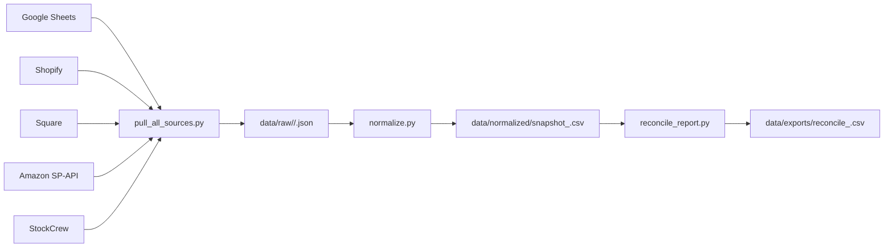

# kohodo-ops

在庫オペレーション向けの **取得（read only）→ 正規化 → 差分レポート** を行う最小構成リポジトリです。

## できること
- Google Sheets / Shopify / Square / Amazon SP-API / StockCrew からスナップショット取得（現時点は読み取り専用）
- `data/raw/<source>/<date>.json` へ保存
- 各ソースを共通フォーマットへ正規化し、`data/normalized/snapshot_<date>.csv` を生成
- SKU × ロケーション単位でソース間差分を出し、`data/exports/reconcile_<date>.csv` を生成

> 実データはコミットしない設計です。ローカル検証用ダミーデータは `data/samples/` に用意しています。

---

## セットアップ

```bash
python -m venv .venv
source .venv/bin/activate
pip install -r requirements.txt
cp .env.example .env
```

必要に応じて `.env` の `*_MOCK_FILE` を `data/samples/*.json` に向けます（デフォルトで設定済み）。

---

## 実行方法

### 一括実行（推奨）
```bash
make run
```

### 日付指定実行
```bash
make run DATE=2026-02-12
```

### 個別実行
```bash
python jobs/pull_all_sources.py --date 2026-02-12
python jobs/normalize.py --date 2026-02-12
python jobs/reconcile_report.py --date 2026-02-12
```

---

## 出力先
- Raw: `data/raw/<source>/<date>.json`
- Normalized: `data/normalized/snapshot_<date>.csv`
- Report: `data/exports/reconcile_<date>.csv`

---

## データフロー図


